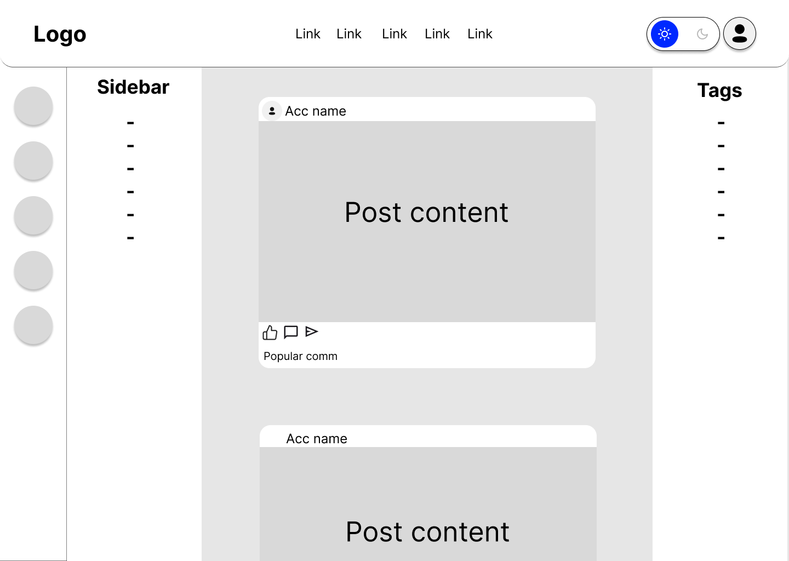

# Guppy - Sociální síť pro organizace

# Ročníková práce 3.E 2024/25

## Zadání
Sociální síť určená pro jednoduchou a přehlednou komunikaci v organizacích. 

## Technologie

## Základní wireframe

## [Google slides prezentace](https://docs.google.com/presentation/d/1WO7o9d8nuaDlQJwYxuhdWE-_Z83ZtpZJ_-LlbMAXY2E/edit?usp=sharing)

## Autoři
- Jakub Hanslík
- Ilja Novák
- Bruno Chvalkovský
- Milan Tuček
