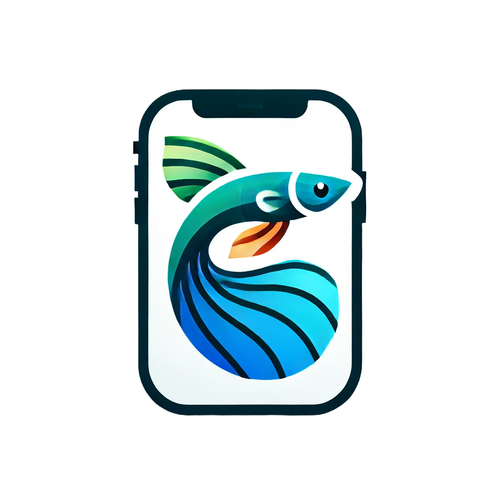

# Guppy - Sociální síť pro organizace

## Zadání
Sociální síť určená pro jednoduchou a přehlednou komunikaci v organizacích. 

## Technologie

## Autoři
- Jakub Hanslík
- Ilja Novák
- Bruno Chvalkovský
- Milan Tuček
